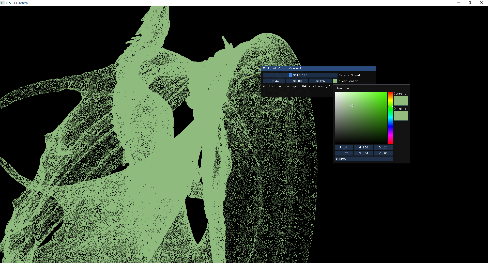

# pointCloudViewer

minimal point cloud viewer to test the concepts

## User Controls
- 'WASD' -  to control the camera location
- hold left mouse button and drag to move the camera view
- change the camera speed and the point cloud color from the GUI
